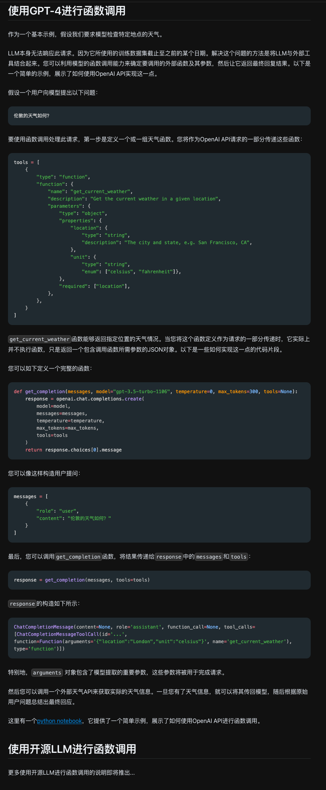

# 简单示例

[原地址](https://www.promptingguide.ai/zh/applications/function_calling)



---

## AI解释上面示例

我们用一个 **具体的代码实例**（基于Python和OpenAI API）来演示每个步骤，这样更直观。假设我们要实现“查询伦敦天气”的功能，分四步拆解：

### **第一步：定义工具（写一个“查天气”的函数）**

我们先告诉AI“有什么工具可用”，这里用代码定义一个函数（或工具描述），比如：

#### **工具函数（真实可调用的代码）**

```python
import requests

def get_current_weather(location: str, unit: str = "celsius") -> dict:
    """
    获取指定地点的当前天气
    :param location: 城市名称（必填）
    :param unit: 温度单位，可选'celsius'（摄氏）或'fahrenheit'（华氏），默认摄氏
    :return: 包含温度、天气状况的字典，例如{"temperature": 20, "condition": "sunny"}
    """
    api_key = "你的OpenWeatherMap API密钥"  # 需提前申请
    url = f"http://api.openweathermap.org/data/2.5/weather?q={location}&appid={api_key}"
    response = requests.get(url)
    data = response.json()
    # 解析数据（简化示例）
    temperature = data["main"]["temp"]
    if unit == "celsius":
        temperature -= 273.15  # 开尔文转摄氏
    condition = data["weather"][0]["main"].lower()
    return {"temperature": round(temperature, 1), "condition": condition}
```

#### **告诉AI这个工具的“使用说明”**

当和AI（如GPT-4）交互时，需要通过 **函数调用格式** 告诉它这个工具的信息（通常用JSON描述）：

```json
{
  "name": "get_current_weather",
  "description": "获取某个地点的当前天气",
  "parameters": {
    "type": "object",
    "properties": {
      "location": {
        "type": "string",
        "description": "城市名称，例如伦敦、北京"
      },
      "unit": {
        "type": "string",
        "enum": ["celsius", "fahrenheit"],
        "description": "温度单位，默认摄氏"
      }
    },
    "required": ["location"]  # location是必填参数
  }
}
```

这一步相当于给AI一本“工具说明书”，让它知道“有什么工具”“怎么用”。

### **第二步：用户提问，AI决定“调用哪个工具、传什么参数”**

#### **用户提问**：“伦敦的天气如何？”

#### **AI的思考过程**（伪代码）

1. 分析问题：用户想知道伦敦的实时天气，需要用`get_current_weather`工具。
2. 提取参数：问题中提到“伦敦”，所以`location`填“伦敦”；用户没提温度单位，用默认值`celsius`（可不填）。
3. 生成函数调用：按照工具说明书的格式，生成调用指令。

#### **AI输出的函数调用（JSON格式）**

```json
{
  "function_call": {
    "name": "get_current_weather",
    "parameters": {
      "location": "伦敦"
    }
  }
}
```

（注：不同AI平台的函数调用格式可能略有不同，比如OpenAI的API需要包裹在`messages`中，但核心是告诉工具名和参数。）

### **第三步：人类（或程序）帮AI“执行真正的查询”**

AI不会自己调用`get_current_weather`函数，需要我们用代码实现这一步：

#### **执行工具函数（拿到真实数据）**

```python
# 假设从AI那里拿到了参数：location="伦敦"，unit默认"celsius"
weather_data = get_current_weather(location="伦敦")
print(weather_data)  # 输出：{"temperature": 19.5, "condition": "sunny"}
```

这里会真实调用OpenWeatherMap的API，返回伦敦的实时天气数据（假设当前是19.5摄氏度，晴）。

### **第四步：把数据“还给AI，让它组织语言回答”**

#### **将工具返回的数据“喂”给AI**

我们把`weather_data`作为函数调用的结果，告诉AI：“你之前让我查伦敦天气，结果是温度19.5摄氏度，晴。”

#### **AI生成最终回答**

AI根据原始问题和返回的数据，用自然语言回复：
> “伦敦目前天气晴朗，气温约19.5摄氏度。”

### **完整流程总结（代码级串联）**

1. **定义工具**（告诉AI和程序）：  
   - 给AI的工具说明书（函数描述JSON）  
   - 真实可执行的Python函数（调用天气API）  

2. **用户提问→AI生成函数调用**：  

   ```python
   # 模拟AI生成的调用指令（实际通过API获取）
   ai_function_call = {
       "name": "get_current_weather",
       "parameters": {"location": "伦敦"}
   }
   ```

3. **执行工具→获取真实数据**：  

   ```python
   # 根据AI的指令调用真实函数
   real_data = get_current_weather(
       location=ai_function_call["parameters"]["location"]
   )
   ```

4. **数据返回→AI生成回答**：  

   ```python
   # 模拟AI根据数据生成回答
   prompt_for_ai = f"用户问伦敦的天气如何，查询结果是：温度{real_data['temperature']}摄氏度，天气{real_data['condition']}。请用自然语言回答。"
   ai_response = get_ai_reply(prompt_for_ai)  # 假设这是调用AI的函数
   print(ai_response)  # 输出最终回答
   ```

### **关键细节（通俗版）**

- **AI的定位**：AI是“指挥官”，只负责“决策用什么工具、传什么参数”，不负责“实际干活”（比如联网查数据）。  
- **人类/程序的角色**：是“执行者”，根据AI的指令调用真实工具（比如API），拿到数据后再交给AI“翻译”成人话。  
- **工具的本质**：就是一段代码（或API），能完成AI做不了的事（实时数据、计算、文件操作等），AI通过“函数调用”语法来操控它。

通过这种分工，AI就能借助外部工具回答实时问题（如天气、股票）、执行复杂操作（如生成图片、文件解析），而不用自己“学”所有技能。
