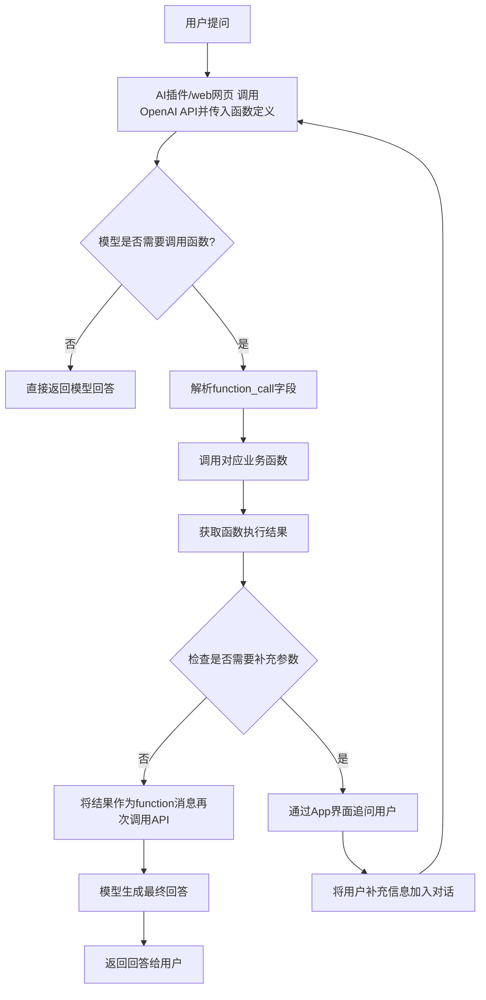

# OpenAI Function Call 示例及解释

假定：我开发了一款AI app，现在需要在应用中集成OpenAI大模型的函数调用功能，需要结合OpenAI API的函数调用机制（如GPT-4或GPT-3.5 Turbo的函数调用能力）和你的App后端逻辑。以下是具体步骤和实现思路：

## function call

### 流程图

openai 函数调用的架构图：



### **一、核心流程概述**

1. **用户提问**：用户通过App发送查询。
2. **模型判断是否需要调用工具**：OpenAI模型根据问题内容，决定是否需要调用外部函数（如获取实时数据、计算、数据库查询等）。
3. **生成函数调用指令**：若需要调用，模型返回包含函数名和参数的JSON结构。
4. **App解析并执行函数**：你的后端解析JSON，调用对应的业务函数（如天气查询、数据库接口等），获取结果。
5. **将结果返回给模型**：将函数执行结果整理成指定格式，再次调用OpenAI API，让模型基于结果生成最终回答。
6. **返回回答给用户**：模型生成自然语言回答，展示在App中。

### **二、具体实现步骤**

#### **1. 定义可调用的函数（工具）**

首先，明确你希望模型能调用的函数列表，并为每个函数编写**规范的描述**（供模型理解功能和参数）。  
**示例函数定义（JSON格式）**：

```python
functions = [
    {
        "name": "get_weather",  # 函数名
        "parameters": {
            "type": "object",
            "properties": {
                "city": {
                    "type": "string",
                    "description": "需要查询天气的城市名称（如：北京）"
                },
                "date": {
                    "type": "string",
                    "description": "查询日期，格式为YYYY-MM-DD（如：2025-05-15）"
                }
            },
            "required": ["city"]  # 必填参数
        },
        "description": "获取指定城市的天气信息"
    },
    {
        "name": "calculate_tax",
        "parameters": {
            "type": "object",
            "properties": {
                "income": {
                    "type": "number",
                    "description": "税前收入（单位：元）"
                },
                "deductions": {
                    "type": "number",
                    "description": "专项扣除金额（单位：元）"
                }
            },
            "required": ["income"]
        },
        "description": "计算个人所得税"
    }
]
```

#### **2. 调用OpenAI API时传入函数定义**

在向OpenAI发送用户查询时，通过`functions`参数告知模型可调用的工具列表。  
**Python示例（使用OpenAI SDK）**：

```python
import openai

openai.api_key = "你的API密钥"

def call_openai_with_functions(user_query):
    response = openai.ChatCompletion.create(
        model="gpt-3.5-turbo-0613",  # 必须使用支持函数调用的模型版本
        messages=[{"role": "user", "content": user_query}],
        functions=functions,  # 传入函数定义
        function_call="auto"  # 让模型自动决定是否调用函数
    )
    return response
```

#### **3. 解析模型返回的函数调用指令**

模型返回的响应中，若包含`function_call`字段，则表示需要调用工具。  
**解析逻辑示例**：

```python
def handle_function_call(response):
    if response.choices[0].message.get("function_call"):
        func_call = response.choices[0].message["function_call"]
        func_name = func_call["name"]
        func_params = eval(func_call["parameters"])  # 转为字典（需注意安全验证！）
        
        # 根据函数名调用实际业务逻辑
        if func_name == "get_weather":
            result = get_weather_from_api(func_params["city"], func_params.get("date"))
        elif func_name == "calculate_tax":
            result = calculate_tax(func_params["income"], func_params.get("deductions"))
        else:
            result = {"error": "未知函数"}
        
        # 将结果格式化为OpenAI要求的格式
        return {
            "name": func_name,
            "parameters": result
        }
    else:
        # 无需调用函数，直接返回模型回答
        return None
```

#### **4. 向模型返回函数执行结果**

获取函数执行结果后，需要再次调用OpenAI API，将结果传递给模型，让其生成最终回答。  
**示例：传递结果给模型**

```python
def send_result_to_model(original_messages, function_result):
    new_message = original_messages + [
        {
            "role": "function",
            "name": function_result["name"],
            "parameters": function_result["parameters"]
        }
    ]
    response = openai.ChatCompletion.create(
        model="gpt-3.5-turbo-0613",
        messages=new_message,
        functions=functions  # 可再次传入函数定义（若需要多轮调用）
    )
    return response.choices[0].message["content"]
```

#### **5. 处理多轮函数调用**

若模型需要进一步补充参数（如缺少必填项），会在返回中提示需要追问用户。此时需在App中设计追问逻辑（如前端弹窗获取更多信息）。  
**示例：处理参数缺失**

```python
def check_required_parameters(func_params, func_def):
    required = func_def["parameters"]["required"]
    missing = [p for p in required if p not in func_params]
    if missing:
        return f"需要补充参数：{', '.join(missing)}"
    return None
```

### **三、关键注意事项**

1. **模型版本要求**：  
   必须使用支持函数调用的模型版本，如：
   - `gpt-3.5-turbo-0613`
   - `gpt-4-0613`  
   旧版本模型不支持`function_call`字段。

2. **参数安全验证**：  
   解析模型返回的`parameters`时，需严格验证参数类型和合法性，防止注入攻击（如限制城市名为合法字符串，收入为正数等）。

3. **错误处理**：  
   - 函数调用失败时（如API超时、参数错误），需返回明确的错误信息给模型，例如：

     ```python
     {
         "name": "get_weather",
         "parameters": {
             "error": "城市名称无效"
         }
     }
     ```

   - 模型会根据错误信息决定是否重试或追问用户。

4. **前端交互设计**：  
   - 若需要用户补充参数（如追问城市名），需在App中设计友好的输入界面，并将用户回复作为新消息传入模型。

### **四、完整流程示例**

1. **用户提问**：“明天上海的天气如何？”  
2. **模型返回**：  

   ```json
   {
     "function_call": {
       "name": "get_weather",
       "parameters": {
         "city": "上海",
         "date": "2025-05-16"
       }
     }
   }
   ```  

3. **App调用天气API**，获取结果：  

   ```json
   {
     "temperature": "22-28℃",
     "condition": "多云",
     "wind": "东南风3级"
   }
   ```  

4. **模型根据结果生成回答**：“明天上海多云，气温22-28℃，东南风3级，适合穿轻薄衣物。”

通过以上步骤，你的App即可实现基于OpenAI大模型的函数调用功能，结合外部工具扩展应用能力。实际开发中可根据业务需求增加更多函数，并优化交互流程。
