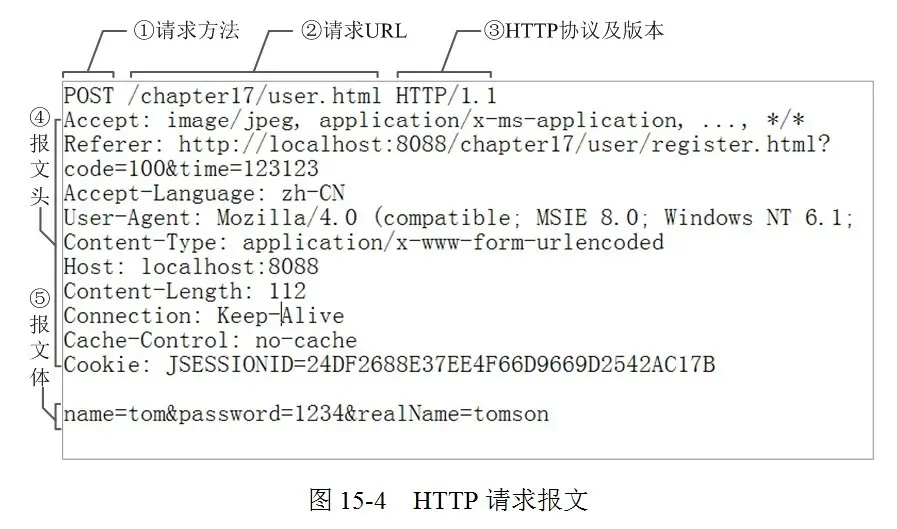
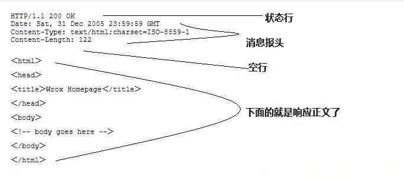

# 基础

## HTTP

超文本传输协议。

请求头格式：



响应头格式：



### GET和POST的区别

- 从参数的传递方面来看,GET请求的参数是直接拼接在地址栏URL的后面,而POST请求的参数是放到请求体里面的.
- 从长度限制方面来看,GET请求有具体的长度限制,一般不超过1024KB,而POST理论上没有,但是浏览器一般都有一个界限.
- 从安全方面来看,GET请求相较于POST,因为数据都是明文显示在URL上面的,所以安全和私密性不如POST
- 从本质上来说,GET和POST都是TCP连接,并无实质的区别.但是由于HTTP/浏览器的限定,导致它们在应用过程中体现出了一些不同.GET产生一个数据包,POST产生两个数据包.对于GET请求,浏览器会把http header 和 data 一并发出去,服务器响应200(返回数据).而对于POST,浏览器先发送header,服务器响应100 continue,浏览器再发送data,服务器响应200 ok

## Java

3*0.1 == 0.3 将会返回什么? true 还是 false?
false，因为有些浮点数不能完全精确的表示出来。解决方案：java使用BigDecimal

---

## Android

## 动画

1. 帧动画
    1. 减少关键帧
    2. drawable子线程提前加载
2. Lottie

## WebView

秒开优化：

1. 全局WebView
2. url清除处理：

    ```kotlin
    //这句话可以重新加载url时保证页面正常刷新，否则会一直复用上个url数据
            webView.loadDataWithBaseURL(null, "", "text/html", "utf-8", null);
    ```

3. 制作离线包，本地加载WebView
4. 非离线包，大资源如字体文件，可以通过拦截url方式，然后返回`WebResourceResponse`对象，其加载本地的数据。
