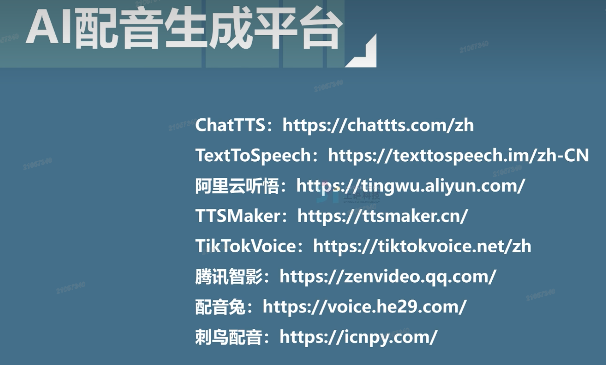

# ai视频

## 1. 文本故事创造

你是一个儿童成长学家和童话故事编写专家，非常擅长书写和改编儿童故事，请编写一个情节简单易懂，人物不超过三个，题材为耐心的儿童故事，适龄儿童为4岁、男孩。故事言简意赅，适当修饰即可，不要辞藻过多，字数约450

## 2. 脚本

用你生成的故事生成脚本，要求25个分镜头左右，每个分镜头不超过五秒，单个分镜头不要有画面景别切换

## 3. 人物设定

你是一位人物角色设计大师，请根据我提供的这份文档，结合文档中的故事目标观众和 人物（或动物） 年龄、性别、说话的语言习惯等因素，设计文档中出现的主要人物的造型，要求设计包括人物的发型、发色、体型、外貌、穿着等，以适用即梦AI图片生成提示词的 方式，把设计造型的文本发给我

## 4. 图片生成

人物图片生成：

1. 豆包生成人物图
2. 即梦AI生成 人物3视图

分镜头图片生成：

1. 豆包直接说  
2. kcontext 工作流 保证画风一样
3. ps+stifftion 进行精准微调

## 5. 生成视频提示词

在豆包：

你是一位AI视频创作大师，现在请根据脚本中的景别和画面描述，生成前5个分镜头画面，比例要求16:9

## 6. 配乐

1. 配乐(AI生成，避免版权问题)

你是一位配乐大师，精通各类配乐制作，你需要仔细阅读故事文本，为其创造符合环境、人物、氛围的纯音乐风格（例如：摇滚、安静）提示词，用于AI音乐生成  

2. 人物对白：配音平台+视频平台对口型

3. AISFX 环境音效

## 7. 视频剪辑
